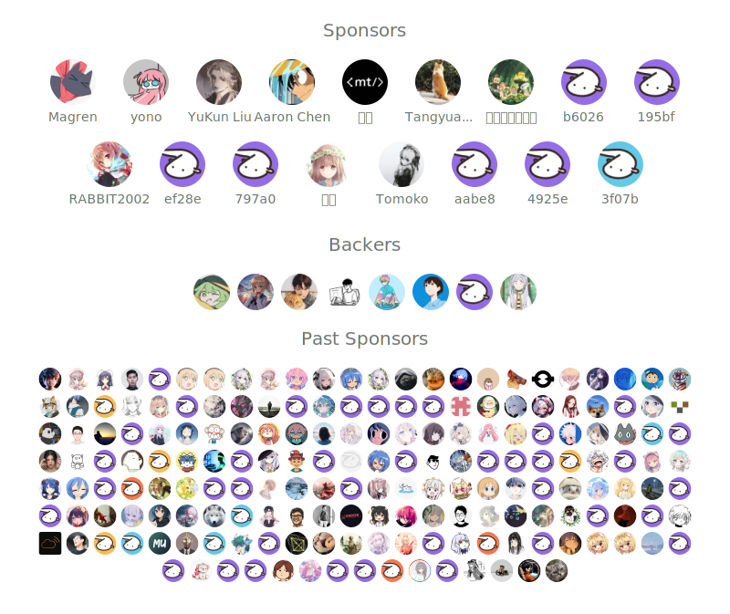

```bash
$ whoami
innei — design engineer · digital nomad
building beautiful things with code

$ echo $STACK
TypeScript · React · Next.js · NestJS · Swift

$ rank
██████████ S
```

<p align="center">
  「<strong><samp> <strong>お可愛いこと。</strong> </samp></strong>」
</p>

<br />

### Featured Work

- **[Innei/Shiro](https://github.com/Innei/Shiro)** — 📜 A minimalist personal website embodying the purity of paper and freshness of snow. ★4144
- **[Afilmory/afilmory](https://github.com/Afilmory/afilmory)** — Modern photo gallery for photographers, with S3/GitHub sync, EXIF details, maps, and a WebGL viewer. ★2442
- **[Torrent-Vibe/Torrent-Vibe](https://github.com/Torrent-Vibe/Torrent-Vibe)** — Torrent Vibe, a modern, elegant web interface for qBittorrent that transforms your torrent management experience with enhanced performance, intuitive design, and cross-platform compatibility. ★147
- **[lobehub/lobehub](https://github.com/lobehub/lobehub)** — The ultimate space for work and life — to find, build, and collaborate with agent teammates that grow with you. We are taking agent harness to the next level — enabling multi-agent collaboration, effortless agent team design, and introducing agents as the unit of work interaction. ★73347

### Recent Writing

- [Refactoring in the AI Era: From RFC to Five Plans](https://innei.in/posts/programming/ai-era-refactoring-from-rfc-to-five-plans) — 3/10/26
- [Spring Festival on the Keyboard](https://innei.in/notes/208) — 3/2/26
- [The Efficiency Paradox of the AI Era: When Increased Productivity Brings Fatigue Instead](https://innei.in/posts/experience/ai-era-efficiency-paradox-productivity-gains-cause-fatigue) — 3/1/26
- [Spring Festival Memories as the Flavor Fades](https://innei.in/notes/207) — 2/17/26
- [Just Working: Work and Life in the AI Era](https://innei.in/notes/206) — 1/26/26

<br />

<p align="center">
  <a href="https://github.com/sponsors/innei">
    
  </a>
</p>

<p align="center">
  <a href="https://github.com/innei">GitHub</a> ·
  <a href="https://twitter.com/__oQuery">Twitter</a> ·
  <a href="https://innei.in">Blog</a>
</p>

<p align="right">
  
</p>
