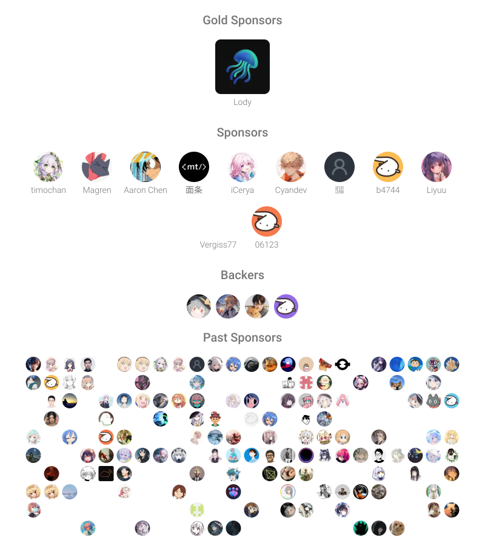

```bash
$ whoami
innei — design engineer · digital nomad
building beautiful things with code

$ echo $STACK
TypeScript · React · Next.js · NestJS · Swift

$ rank
██████████ S
```

<p align="center">
  「<strong><samp> <strong>Ich bin bereit, zu sterben, bereit, wieder geboren zu werden.</strong> </samp></strong>」
</p>

<br />

### Featured Work

- **[Innei/Yohaku](https://github.com/Innei/Yohaku)** — 余白 / Yohaku — A typographic design system for written content. One accent, three neutral tiers, the rest is whitespace. ★176
- **[Afilmory/afilmory](https://github.com/Afilmory/afilmory)** — Modern photo gallery for photographers, with S3/GitHub sync, EXIF details, maps, and a WebGL viewer. ★2608
- **[Torrent-Vibe/Torrent-Vibe](https://github.com/Torrent-Vibe/Torrent-Vibe)** — Torrent Vibe, a modern, elegant web interface for qBittorrent that transforms your torrent management experience with enhanced performance, intuitive design, and cross-platform compatibility. ★158
- **[kansoku-trade/kansoku](https://github.com/kansoku-trade/kansoku)** — AI Stock Partner on Your Mac – Local Market Information, Multi-timeframe K-line, AI Intraday Comments and Follow-up Analysis ★303
- **[lobehub/lobehub](https://github.com/lobehub/lobehub)** — 🤯 LobeHub is your Chief Agent Operator, organizing your agents into 7×24 operations by hiring, scheduling, and reporting on your entire AI team. ★82210

### Recent Writing

- [From Pure CSS to StyleX: Migrating 10,000 Lines of CSS with AI](https://innei.in/posts/tech/css-to-stylex-migration) — 8/30/26
- [Midnight Notes: On Love, Freedom, and the Future](https://innei.in/notes/219) — 8/25/26
- [UIKitCore Reverse Engineering Report](https://innei.in/posts/tinkering/uikitcore-reverse-engineering-report) — 8/23/26
- [My Development Workflow in the Age of AI: From Debugging Post-Mortems to Parallel Verification](https://innei.in/posts/tinkering/ai-era-dev-workflow-review-and-verify) — 8/17/26
- [Circulating Through Life](https://innei.in/notes/218) — 8/5/26

<br />

<p align="center">
  <a href="https://github.com/sponsors/innei">
    
  </a>
</p>

<p align="center">
  <a href="https://github.com/innei">GitHub</a> ·
  <a href="https://twitter.com/__oQuery">Twitter</a> ·
  <a href="https://innei.in">Blog</a>
</p>

<p align="right">
  
</p>
