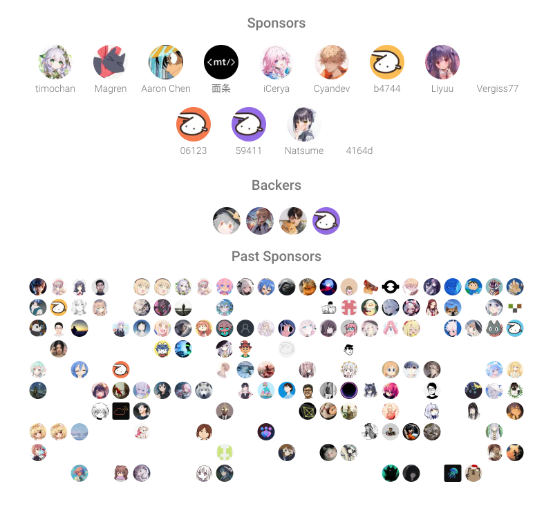

```bash
$ whoami
innei — design engineer · digital nomad
building beautiful things with code

$ echo $STACK
TypeScript · React · Next.js · NestJS · Swift

$ rank
██████████ S
```

<p align="center">
  「<strong><samp> <strong>Ich bin bereit, zu sterben, bereit, wieder geboren zu werden.</strong> </samp></strong>」
</p>

<br />

### Featured Work

- **[Innei/Yohaku](https://github.com/Innei/Yohaku)** — 余白 / Yohaku — A typographic design system for written content. One accent, three neutral tiers, the rest is whitespace. ★194
- **[Innei/lody-ios](https://github.com/Innei/lody-ios)** — Independent iOS client for Lody — native chat, sessions, and coding-agent collaboration on iPhone ★511
- **[Afilmory/afilmory](https://github.com/Afilmory/afilmory)** — Modern photo gallery for photographers, with S3/GitHub sync, EXIF details, maps, and a WebGL viewer. ★2650
- **[Torrent-Vibe/Torrent-Vibe](https://github.com/Torrent-Vibe/Torrent-Vibe)** — Torrent Vibe, a modern, elegant web interface for qBittorrent that transforms your torrent management experience with enhanced performance, intuitive design, and cross-platform compatibility. ★159
- **[kansoku-trade/kansoku](https://github.com/kansoku-trade/kansoku)** — AI Stock Partner on Your Mac – Local Market Information, Multi-timeframe K-line, AI Intraday Comments and Follow-up Analysis ★328
- **[lobehub/lobehub](https://github.com/lobehub/lobehub)** — 🤯 LobeHub is your Chief Agent Operator, organizing your agents into 7×24 operations by hiring, scheduling, and reporting on your entire AI team. ★83112

### Recent Writing

- [How I Verify AI-Native iOS Development](https://innei.in/posts/tech/ai-native-ios-e2e-verification) — 10/10/26
- [Rain, Then Sun](https://innei.in/notes/220) — 10/6/26
- [Making a Steins;Gate Music Video with Claude Code, Codex, and Remotion](https://innei.in/posts/tinkering/steins-gate-mv-with-claude-code) — 9/30/26
- [Making Electron Updates Fast: The Times I Tore Down and Rebuilt My OTA Update System](https://innei.in/posts/tech/electron-ota-updater) — 9/29/26
- [Prototype in a Day, Shipped in a Week: Building Lody iOS in Live](https://innei.in/posts/tech/lody-ios-prototype-to-product) — 9/13/26

<br />

<p align="center">
  <a href="https://github.com/sponsors/innei">
    
  </a>
</p>

<p align="center">
  <a href="https://github.com/innei">GitHub</a> ·
  <a href="https://twitter.com/__oQuery">Twitter</a> ·
  <a href="https://innei.in">Blog</a>
</p>

<p align="right">
  
</p>
