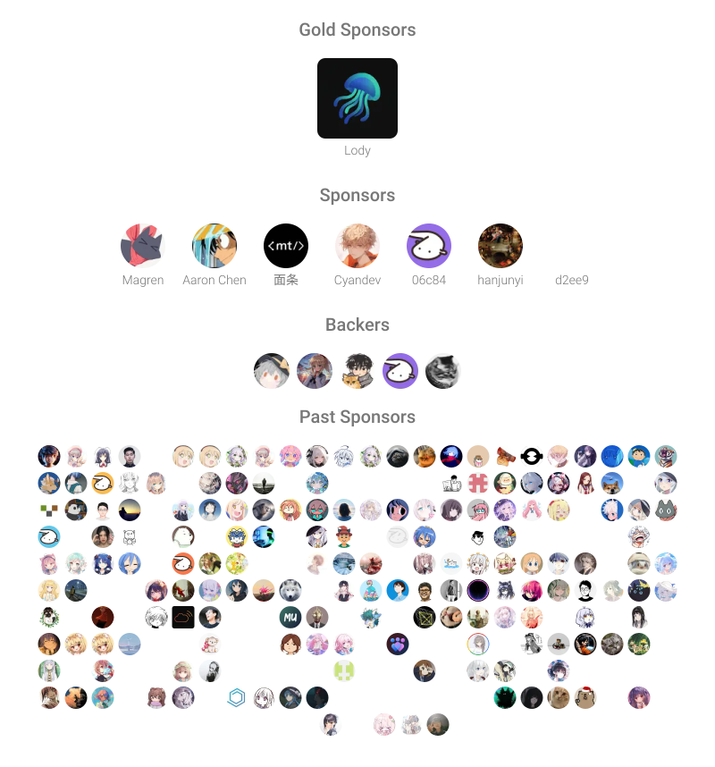

```bash
$ whoami
innei — design engineer · digital nomad
building beautiful things with code

$ echo $STACK
TypeScript · React · Next.js · NestJS · Swift

$ rank
██████████ S
```

<p align="center">
  「<strong><samp> <strong>Ich bin bereit, zu sterben, bereit, wieder geboren zu werden.</strong> </samp></strong>」
</p>

<br />

### Featured Work

- **[Innei/Yohaku](https://github.com/Innei/Yohaku)** — 余白 / Yohaku — A typographic design system for written content. One accent, three neutral tiers, the rest is whitespace. ★212
- **[LodyAI/lody-ios](https://github.com/LodyAI/lody-ios)** — Independent iOS client for Lody — native chat, sessions, and coding-agent collaboration on iPhone ★535
- **[Afilmory/afilmory](https://github.com/Afilmory/afilmory)** — Modern photo gallery for photographers, with S3/GitHub sync, EXIF details, maps, and a WebGL viewer. ★2682
- **[Innei/ryugi](https://github.com/Innei/ryugi)** — Ryugi (ryoo-ghee) — Interactive Artifacts for Coding Agents: artboards of mockups, design docs, whiteboards, HTML benches and verify reports you comment on, with every comment sent back to the agent. ★786
- **[kansoku-trade/kansoku](https://github.com/kansoku-trade/kansoku)** — AI Stock Partner on Your Mac – Local Market Information, Multi-timeframe K-line, AI Intraday Comments and Follow-up Analysis ★338
- **[lobehub/lobehub](https://github.com/lobehub/lobehub)** — 🤯 LobeHub - Super-Agents on Your Team. Add super-agents to the chats your team already uses.They take on work by themselves and get better every week. ★86002

### Agent Code Navigation

- [Agent Code Navigation](./AGENTS.md)
- Curated index of personal + maintained org repositories
- Separates copy-friendly permissive licenses from study-first custom / copyleft projects

### Recent Writing

- [The Aesthetic Deficit of the AI Era: When Anyone Can Build an App](https://innei.in/posts/thinking/ai-aesthetic-deficit-anyone-can-build-an-app) — 11/19/26
- [Ask First, Draw It Out, Then Prove It: My Ryugi Workflow for Coding Agents](https://innei.in/posts/tech/ryugi-workflow) — 11/15/26
- [Migrating from React Native to UIKit in 87 Hours: Hollow Out the Data Layer, Then Invert the Host](https://innei.in/posts/tech/react-native-to-uikit-migration) — 11/8/26
- [Replacing Ant Design with Base UI and StyleX: A 10-Month Incremental Migration at LobeHub](https://innei.in/posts/tech/lobehub-antd-to-base-ui-stylex-migration) — 11/4/26
- [October Lingers](https://innei.in/notes/221) — 10/25/26

<br />

<p align="center">
  <a href="https://github.com/sponsors/innei">
    
  </a>
</p>

<p align="center">
  <a href="https://github.com/innei">GitHub</a> ·
  <a href="https://twitter.com/__oQuery">Twitter</a> ·
  <a href="https://innei.in">Blog</a>
</p>

<p align="right">
  <picture>
    <source media="(prefers-color-scheme: dark)" srcset="./innei-signature-dark.svg" />
    <source media="(prefers-color-scheme: light)" srcset="./innei-signature-light.svg" />
    
  </picture>
</p>
