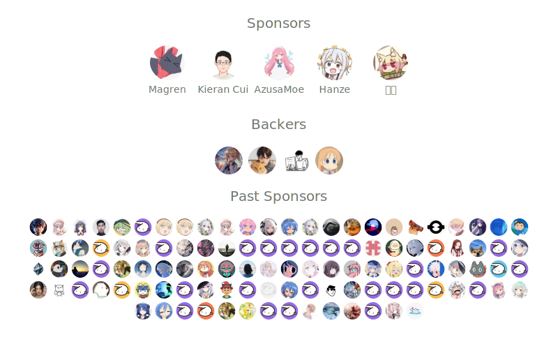

```bash
$ cat /etc/passwd | grep innei
> A creative developer who is passionate about open source and building beautiful things.
> Digital Nomad. Design engineer. AI Commander.

$ neofetch

innei@github
───────────
OS: macOS, Arch, Ubuntu                                   ／＞　 フ
Bio: Creative Dev, Open Source Enthusiast                | 　_　_|
Status: Digital Nomad                                  ／` ミ＿xノ
Skills:                                                ／　　　　 |
  ├─ Langs: TypeScript, Swift                          (　 ヽ＿ヽ_)__)
  ├─ Frontend: React, Next.js                          ＼二 )
  ├─ Backend: NestJS, Node.js, Drizzle
  ├─ Infra: Docker, Redis, PostgreSQL, MongoDB
  └─ Agent: Cursor, Claude Code, Codex
GitHub Stats:
  ├─ Stars Earned: 5909
  ├─ Commits (This Year): 918
  ├─ Total PRs: 910
  ├─ Total Issues: 354
  └─ Contributed to (Last Year): 18

Rank: [ PROGRESS ██████████] A+
```

<p align="center">
  「<strong><samp> <strong>お可愛いこと。</strong> </samp></strong>」
</p>

<br />

<table>
  <tr>
    <td valign="top" width="50%">
      <details open>
        <summary>What I'm Hacking On</summary>
        <br />
          <ul><li><a href=https://github.com/Innei/Shiro target=_blank>Innei/Shiro</a> (<b>★ 4115</b>)<br>↳ <i>📜 A minimalist personal website embodying the purity of paper and freshness of snow.</i></li><li><a href=https://github.com/Afilmory/afilmory target=_blank>Afilmory/afilmory</a> (<b>★ 2415</b>)<br>↳ <i>Modern photo gallery for photographers, with S3/GitHub sync, EXIF details, maps, and a WebGL viewer.</i></li><li><a href=https://github.com/Torrent-Vibe/Torrent-Vibe target=_blank>Torrent-Vibe/Torrent-Vibe</a> (<b>★ 142</b>)<br>↳ <i>Torrent Vibe, a modern, elegant web interface for qBittorrent that transforms your torrent management experience with enhanced performance, intuitive design, and cross-platform compatibility.</i></li><li><a href=https://github.com/lobehub/lobehub target=_blank>lobehub/lobehub</a> (<b>★ 71803</b>)<br>↳ <i>The ultimate space for work and life — to find, build, and collaborate with agent teammates that grow with you. We are taking agent harness to the next level — enabling multi-agent collaboration, effortless agent team design, and introducing agents as the unit of work interaction.</i></li></ul>
      </details>
      <br />
      <details>
        <summary>Side Projects & Toys</summary>
        <br />
          <ul><li><a href=https://github.com/Innei/face-mask-web target=_blank>Innei/face-mask-web</a> (<a href=https://face-mask-web.vercel.app target=_blank>demo</a>) (<b>★ 19</b>)<br>↳ <i>An AI-based face detection and Emoji replacement web-app</i></li><li><a href=https://github.com/Innei/ProcessReporter target=_blank>Innei/ProcessReporter</a> (<b>★ 25</b>)<br>↳ <i>A macOS application built with AppKit/Cocoa that monitors and reports real-time system activity.</i></li><li><a href=https://github.com/Innei/vite-plugin-route-builder target=_blank>Innei/vite-plugin-route-builder</a> (<b>★ 5</b>)</li></ul>
      </details>
    </td>
    <td valign="top" width="50%">
      <details open>
        <summary>Recent Posts</summary>
        <br />
          <ul><li><span><a href=https://innei.in/notes/206>不过是上班：AI 时代的工作与生活</a></span> - 1/26/26</li><li><span><a href=https://innei.in/posts/tech/lobehub-performance-dx-optimization>记 LobeHub 的性能和 DX 优化</a></span> - 1/13/26</li><li><span><a href=https://innei.in/posts/tech/how-to-use-ai-for-assisted-creation>我是如何使用 AI 辅助创作的</a></span> - 12/28/25</li><li><span><a href=https://innei.in/notes/205>2025 · 仍在路上，半径之外</a></span> - 12/27/25</li><li><span><a href=https://innei.in/notes/204>在安稳中寻求生存</a></span> - 12/14/25</li></ul>
      </details>
      <br />
      <details>
        <summary>Recent Discovery</summary>
        <br />
          <ul><li><a href=https://github.com/lbjlaq/Antigravity-Manager>lbjlaq/Antigravity-Manager</a><span> Professional Antigravity Account Manager & Switcher. One-click seamless account switching for Antigravity Tools. Built with Tauri v2 + React (Rust).专业的 Antigravity 账号管理与切换工具。为 Antigravity 提供一键无缝账号切换功能。</span></li><li><a href=https://github.com/exo-explore/exo>exo-explore/exo</a><span> Run frontier AI locally.</span></li><li><a href=https://github.com/promptfoo/promptfoo>promptfoo/promptfoo</a><span> Test your prompts, agents, and RAGs. AI Red teaming, pentesting, and vulnerability scanning for LLMs. Compare performance of GPT, Claude, Gemini, Llama, and more. Simple declarative configs with command line and CI/CD integration.</span></li><li><a href=https://github.com/coollabsio/coolify>coollabsio/coolify</a><span> An open-source, self-hostable PaaS alternative to Vercel, Heroku & Netlify that lets you easily deploy static sites, databases, full-stack applications and 280+ one-click services on your own servers.</span></li><li><a href=https://github.com/Open-Dev-Society/OpenStock>Open-Dev-Society/OpenStock</a><span> OpenStock is an open-source alternative to expensive market platforms. Track real-time prices, set personalized alerts, and explore detailed company insights — built openly, for everyone, forever free.</span></li></ul>
      </details>
    </td>
  </tr>
</table>

<br />

<p align="center">
  <a href="https://github.com/sponsors/innei">
    
  </a>
</p>

<p align="center">
  <a href="https://github.com/innei" target="_blank"></a> 
  <a href="https://twitter.com/__oQuery" target="_blank"></a> 
  <a href="https://innei.in" target="_blank"></a>
</p>

<p align="center">
  <samp>
    <p align=center>This <i>README</i> <b>refreshes every 24 hours</b> automatically!<br>Refreshed at: 2/2/26, 8:15 AM<br>Next refresh: 2/3/26, 8:15 AM</p>
  </samp>
</p>
