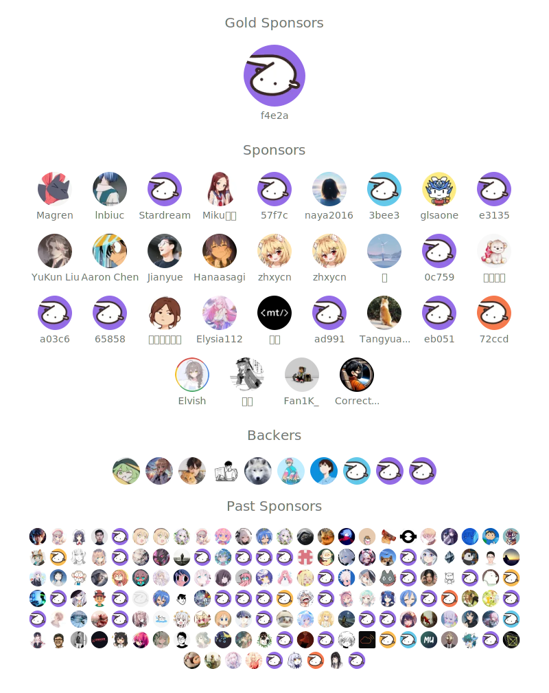

# Innei 🧑🏻‍💻  

<picture>
  <source
    srcset="https://github-readme-stats.vercel.app/api?username=innei&show_icons=true&theme=dark"
    media="(prefers-color-scheme: dark)"
  />
  <source
    srcset="https://github-readme-stats.vercel.app/api?username=innei&show_icons=true"
    media="(prefers-color-scheme: light), (prefers-color-scheme: no-preference)"
  />
  
</picture>

Innei is a beginner who is passionate about exploring new things in full-stack development. <!-- Currently, he is a newcomer to the workforce and is located in Shanghai.-->

In the developer field, he often actively participates in GitHub and aspires to become a freelancer.

<!--
> Hey, I am considering looking for remote work opportunities. My resume is [here](https://resume.innei.ren/), feel free to hit me up!
>
> 嘿，我正在考虑寻找远程工作机会，简历在 [这里](https://resume.innei.ren/)，欢迎来撩我！ -->

He has the following skills:

**Web Developer**

  
  
  
  
  
  
  
  
  
  

**Backend Developer (maybe)**

  
  
  
  
  

**iOS Developer (prospective)**

  
  

**DevOps**

  
  
  
  
  

**Environment**

  
  
  

<!-- 

  
  

 -->

**Open Source...**

<!-- opensource_dashboard:active -->

**Toys...**

<!-- opensource_toys -->

**Recent Writing...**

<!-- recent_posts_inject -->

**Recent Star...**

<!-- recent_star_inject -->

**Review Stared...**

<!-- random_github_stars_inject -->

**Can you find me?**

 <a href="https://twitter.com/__oQuery" target="_blank"> 

---

<!-- motto -->
<!-- footer_inject -->
